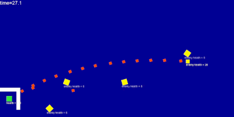

<link rel="stylesheet" type="text/css" media="all" href="style.css" />

# Game
by Ivan



## Introduction


Introduce your game here.

- How do you play it?

    Use {W,A,S,D} to move and click mouse to shoot.

- What does the player do?

    You need to evade enemy's bullet and shoot the enemies.

- What do the enemies do?

    Enemies will shoot you.

- How do you win?

    Kill the boss in time then you win.

- How do you lose?

    If your health is zero then you lose.


---

## Implementation Details

- Which programming language/ tools did you use?

    I used Python and Pycat (a python game library) to make this game.
    From pycat I use the ``Color``, ``KeyCode``, ``Sprite``, ``Window``, ``Scheduler``, and ``Label`` classes.
    I also use randint from the random module

- Which programming concepts did you use and how?

    I use inheritance, iteration, lists, conditionals, variables, functions, etc.

- What were some of the problems you faced and how did you solve them?

    The code below shoots a bullet at the enemy closest to the player.

    ``` python
    if window.is_key_down(KeyCode.SPACE):
        enemy=window.get_sprites_with_tag('enemy')
        bullet=window.create_sprite(Bullet)
        min_d=1000000000
        for e in enemy:
            d=self.distance_to(e.position)
            if d<min_d:
                min_d=d
                bullet.point_toward_sprite(e)
    ```

---

## Game Design

- What makes it challenging?

    You need to evade lot of enemy's bullet

---

## Code

A link to the [code](https://github.com/iiiiivan/python-class-0/blob/main/L14/l14.py)
